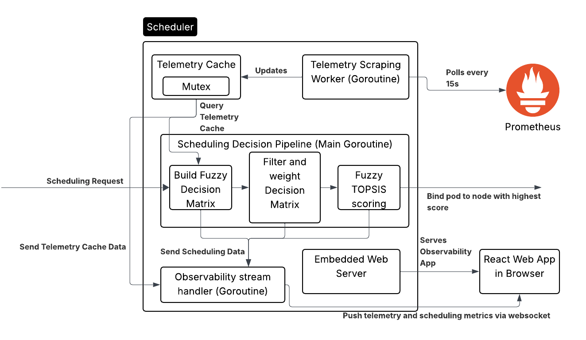

# Telemetry-Driven bin packing scheduler for Kubernetes
A custom Kubernetes scheduler which utilises telemetry and the fuzzy TOPSIS MCDM (multi criteria decision making) framework, to bin pack stable nodes and avoid unstable nodes.

## Table of Contents
## Table of Contents
* [Architecture](#architecture)
* [Usage](#usage)
    * [Cluster](#cluster)
    * [Scheduler](#scheduler)
    * [Testing](#testing-framework)
* [Scheduler Packages](#scheduler-packages)
* [Observability Dashboard](#observability-dashboard)
* [Creating Kubernetes Deployments](#creating-kubernetes-deployments)


## Architecture
The scheduler is implemented as a standalone Go application which can replace the default scheduler. It utilises a multithreaded architecture outlined in the below diagram.


- Live telemetry is scraped every 15 seconds from Prometheus, and stored in a global struct. This allows instant access to the latest telemetry when a scheduling request comes in. This global struct is protected with a mutex to ensure it is thread safe.
- The decision pipeline receives the scheduling requests from the `kube api-server`, and starts the scheduling process. It gets the latest telemetry from the telemetry cache, and populates a fuzzy decision matrix. This allows the fuzzy TOPSIS algorithm to select a node, which the decision pipeline then binds the pod to.
- The observability dashboard is a debugging web application which is served from the scheduler. One goroutine serves the React web application, while another goroutine connects via websocket and sends scheduling updates, breakdowns, and live telemetry.

## Usage
### Cluster
There is configuration for two types of clusters to be setup for local development within this repository.
1. **KIND** - Within the `/cluster/kind` directory there is a file `kind-cluster-config.yaml`, which can be used to set up a local cluster with 3 nodes.

    To set this up, ensure you have [Docker](https://docs.docker.com/engine/install/), and [KIND](https://kind.sigs.k8s.io/docs/user/quick-start/) installed on your local system.

    Following this run the following commands to create the cluster
    ```
    cd cluster/kind
    kind create cluster --config kind-cluster-config.yaml
    ```

    Then Prometheus needs to be installed. The easiest way is through using Helm. [Helm installation instructions](https://helm.sh/docs/intro/install/). Then run these commands.
    ```
    helm repo add prometheus-community https://prometheus-community.github.io/helm-charts 
    helm repo update

    kubectl create namespace monitoring
    helm install kube-prom-stack prometheus-community/kube-prometheus-stack --namespace monitoring
    ```
2. **Multipass VMs** - Within the `/cluster/multipass` directory is the setup for a Kubernetes cluster which uses multipass virtual machines, each running microk8s. This is a better test environment than KIND, but requires more compute.

    This requires the computer to have virtualisation support. [Multipass must be installed for this to work.](https://documentation.ubuntu.com/multipass/latest/how-to-guides/install-multipass/) Python 3.1+ is a prerequisite. 

    Following this run these commands which will automatically set up the cluster, and Prometheus. **This takes a long time**
    ```
    cd cluster/multipass
    python3 setup.py
    ```

    To delete the cluster to either restart or just stop it running use the `purge.py` script.
    ```
    cd cluster/multipass
    python3 purge.py
    ```

    **Note** - This has only been tested on an Ubuntu system.


    
### Scheduler
The scheduler is run on the control plane/master node as a Go application, instead of as a pod on the cluster. This was just done for ease of iterative development.

To run the scheduler, ensure [Go is installed](https://go.dev/doc/install).

The React observability dashboard needs to be compiled before the scheduler is run. To do this ensure `npm` is [installed](https://docs.npmjs.com/downloading-and-installing-node-js-and-npm). Then
```
cd scheduler/pkg/dashboard/web/scheduler
npm install
npm run build
```
This only needs to be done once, or after any changes to the web dashboard.

In one terminal port forward Prometheus so the scheduler can access it:
```
# for microk8s cluster (e.g. the multipass cluster)
microk8s kubectl port-forward -n observability svc/kube-prom-stack-kube-prome-prometheus 9090:9090
# for KIND cluster
kubectl port-forward -n monitoring svc/kube-prom-stack-kube-prome-prometheus 9090:9090
```

Then in another terminal run the following commands to run the scheduler:
```
cd scheduler
go mod tidy

go run cmd/scheduler/main.go
```

### Testing Framework
To reproduce results the testing framework can be used, the main logic is in the `/testing/framework/framework.py`. This imports the test code from the `/tests` directory which run the tests while the `framework.py` file handles recording data during the test.

To run the tests go to the bottom of the `framework.py` file, and import the test you want e.g. `from tests.boutique.test_1 import boutique_load_test`, and instantiate the framework class with that function as so: `framework = SchedulerTester(boutique_load_test)`.

Once the test has been chosen, run the test with these commands:
```
cd testing/framework
python3 -m venv venv
source venv/bin/activate
pip3 install -r requirements.txt
python3 framework.py
```

Test results are in the form of `json` files which contain all the logged events, and each test has its own `plot.py` file which can turn these `json` files into graphs.

## Scheduler Packages
```
├── cmd
│   └── scheduler - contains the main.go file to start up the scheduler, telemetry scraper, and observability dashboard.
├── go.mod
├── go.sum
└── pkg
    ├── algorithm - contains the fuzzy TOPSIS logic.
    ├── cluster - Code to fetch cluster details.
    ├── config - Contains the configuration for the scheduler and fuzzy TOPSIS, such as ideals.
    ├── dashboard - Contains code to send data to web dashboard by websocket, and contains the react app source code.
    ├── scheduler - Contains the overall scheduling pipeline.
    ├── telemetry - Code which fetches and caches live telemetry data.
    └── types - Contains all custom types.
```

## Observability Dashboard
Once the scheduler has started running, terminal logs should provide a link to localhost to view the dashboard. Depending on what type of cluster you are using depends on whether this link will work. Otherwise, you will need to use the Control Plane's IP address to access this.

- Localhost: http://localhost:8080
- Node IP: http://<NODE_IP>:8080

## Creating Kubernetes Deployments
To get full advantage of the custom scheduler you must create the deployments the correct way. This scheduler removes the issue of over-provisioning resources in Kubernetes by relying on telemetry instead of resource requests, however `Kubelet` still relies on static requests and therefore can block pods from starting. To avoid this issue, and still give the custom scheduler the correct requests annotations are used instead of requests as shown below in an example deployment. Note that you also need to name the custom scheduler.
```
apiVersion: v1
kind: Pod
metadata:
  name: nginx
  annotations:
    # custom annotations are the real resource requests for the custom scheduler
    scheduler.noah.io/true-cpu-request: "100m"
    scheduler.noah.io/true-mem-request: "64Mi"
spec:
  schedulerName: fuzzy-topsis-scheduler
  containers:
  - name: nginx
    image: nginx:latest
    resources:
      # set the requests artificially low - this tricks Kubelet
      requests:
        cpu: "10m"
        memory: "10Mi"
      # limits should stay realistic
      limits:
        cpu: "500m"
        memory: "256Mi"
    ports:
    - containerPort: 80
```